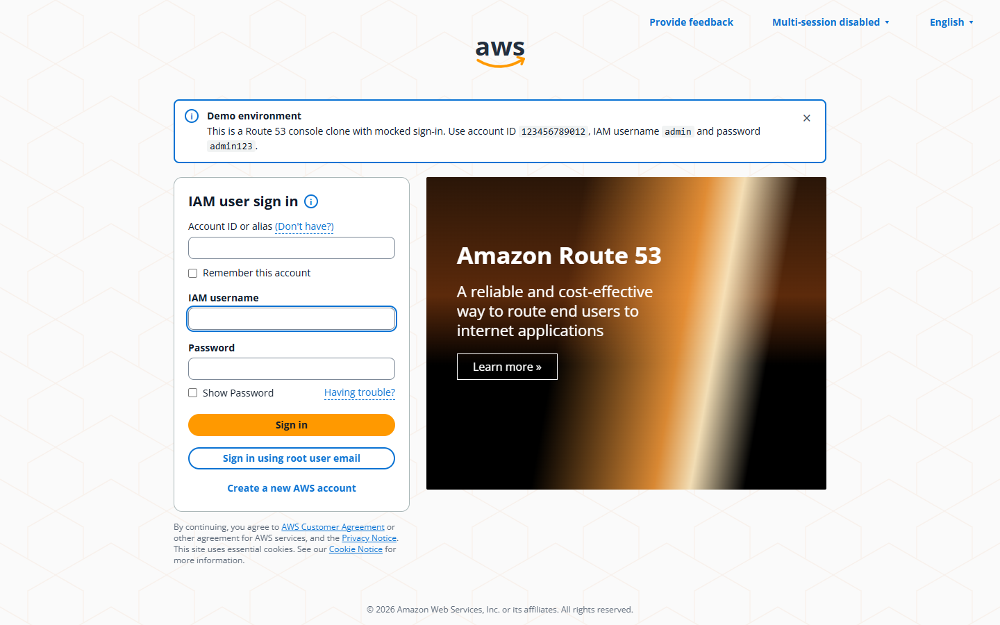
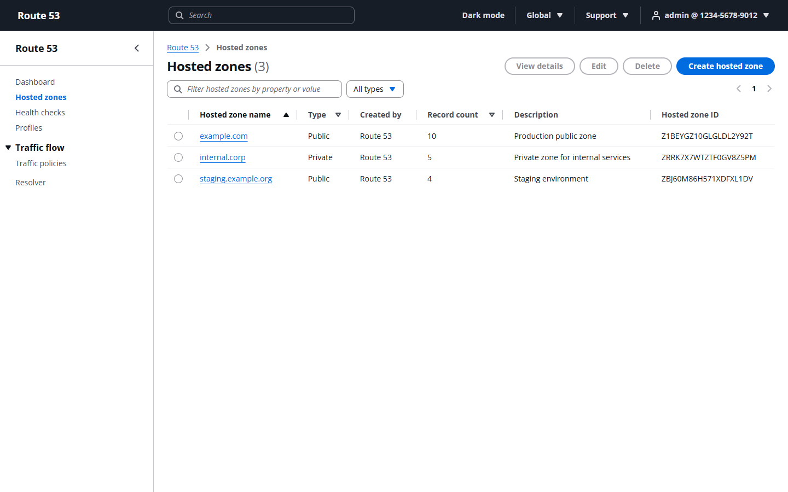
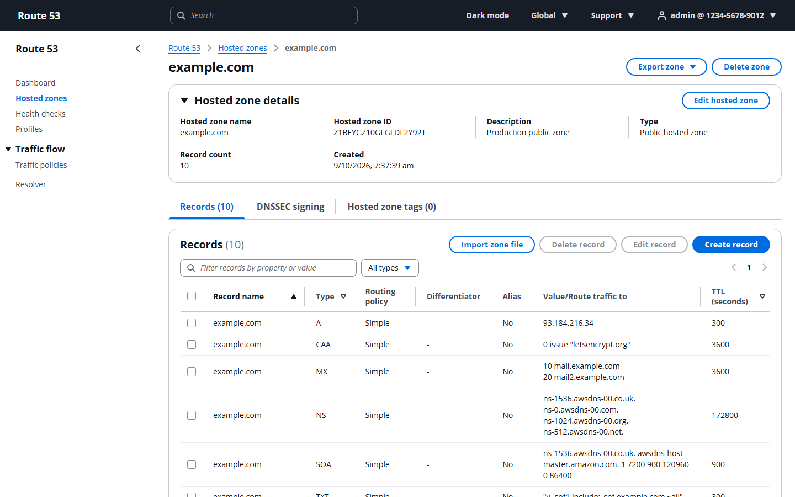
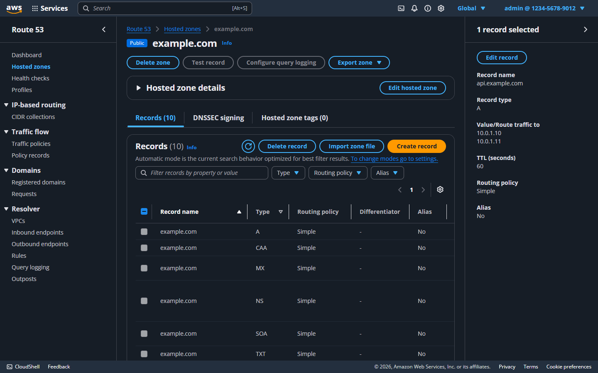

# Amazon Route 53 Clone

A functional clone of the AWS Route 53 console: hosted zone and DNS record management backed by a real API and persistent storage. It recreates the Route 53 user experience and workflows; it does **not** serve actual DNS.

| Layer    | Technology                                             |
| -------- | ------------------------------------------------------ |
| Frontend | Next.js 16 (App Router), TypeScript, Cloudscape Design System, TanStack Query |
| Backend  | FastAPI, SQLAlchemy 2, Pydantic v2                     |
| Database | SQLite                                                 |

**Live demo:** _add the Vercel URL here after deploying (see [Deployment](#deployment))_ &nbsp;·&nbsp; sign in with `admin` / `admin123`.

| Sign-in | Hosted zones |
| --- | --- |
|  |  |

| Zone records, import/export, bulk actions | Dark mode |
| --- | --- |
|  |  |

## Status

| Area                                   | State       |
| -------------------------------------- | ----------- |
| Mocked auth (login / logout / session) | Done        |
| Database models and seed data          | Done        |
| Hosted zones CRUD + search             | Done        |
| DNS records CRUD + search + validation | Done        |
| Route 53 console chrome (nav, sidebar) | Done        |
| "Coming soon" placeholder sections     | Done        |
| Bonus: BIND import, BIND/JSON export | Done        |
| Bonus: bulk record delete              | Done        |
| Bonus: dark mode                       | Done        |
| Bonus: keyboard shortcuts              | Done        |
| Deployment config (Docker, Render, CI) | Done        |

## Repository layout

```
backend/    FastAPI service (API, models, seed data, tests)
frontend/   Next.js application (UI)
```

## Setup

Prerequisites: Python 3.11+ and Node.js 20+.

### Backend

```bash
cd backend
python -m venv .venv
# Windows: .venv\Scripts\activate      macOS/Linux: source .venv/bin/activate
pip install -r requirements.txt
cp .env.example .env                   # optional; defaults work for local dev
uvicorn app.main:app --reload --port 8000
```

On startup the app creates the SQLite file (`route53.db`) and seeds a demo user and sample hosted zones. Seeding is idempotent. Interactive API docs are served at <http://localhost:8000/docs>.

Run the tests:

```bash
python -m pytest
```

### Frontend

```bash
cd frontend
npm install
npm run dev                            # http://localhost:3000
```

The frontend proxies `/api/*` to the backend (`BACKEND_URL`, default `http://127.0.0.1:8000`) so the session cookie stays same-origin.

### Demo credentials

Account ID `123456789012`, IAM username `admin`, password `admin123` (also shown on the sign-in page).

## Architecture

```
Browser ──> Next.js (UI, port 3000)
              │  rewrites /api/* (same-origin cookies)
              ▼
            FastAPI (port 8000)
              routers  →  services  →  SQLAlchemy models  →  SQLite
```

- **routers/** – thin HTTP layer: parse requests, call services, shape responses.
- **services/** – business logic (authentication, zone defaults such as the NS/SOA records Route 53 creates automatically, record validation and conflict rules). Rule violations raise `ServiceError`, which one exception handler turns into the HTTP response.
- **models/** – SQLAlchemy ORM tables. **schemas/** – Pydantic request/response models.
- **core/** – configuration (env driven), DB engine/session, password hashing.
- **Auth** – mocked IAM sign-in (the sign-in page is modeled on the AWS IAM user sign-in screen; the Account ID field is cosmetic and can be remembered in the browser). Credentials are checked against a `users` table (PBKDF2 hashed); a random session token is stored in `sessions` and sent as an `HttpOnly` cookie. Every non-auth route depends on `get_current_user`.
- **Frontend** – an `AuthProvider` restores the session via `/api/auth/me` on load; an `AuthGuard` redirects unauthenticated users to `/login`. UI is built with Cloudscape components, the design system the real AWS console uses, to match its look and feel.

## Database schema

```
users(id PK, username UNIQUE, password_hash, account_id, created_at)

sessions(token PK, user_id FK→users ON DELETE CASCADE, expires_at, created_at)

hosted_zones(id PK "Z…", name, comment, is_private, vpc_region, vpc_id, created_at,
             UNIQUE(name, is_private))

zone_tags(id PK, zone_id FK→hosted_zones ON DELETE CASCADE, key, value)

dns_records(id PK, zone_id FK→hosted_zones ON DELETE CASCADE, name, type, ttl,
            value (one value per line), routing_policy, set_identifier, alias_target,
            created_at, updated_at,
            UNIQUE(zone_id, name, type, set_identifier))
```

Names are stored lower-cased as fully qualified names with a trailing dot. Foreign keys are enforced (`PRAGMA foreign_keys=ON`), so deleting a hosted zone removes its records and tags.

## API overview

Base path: `/api`. All routes except `/auth/login` and `/health` require a valid session cookie.

| Method | Path            | Description                         | Status  |
| ------ | --------------- | ----------------------------------- | ------- |
| GET    | `/health`       | Liveness check                      | Done    |
| POST   | `/auth/login`   | Sign in, sets session cookie        | Done    |
| POST   | `/auth/logout`  | Sign out, clears cookie             | Done    |
| GET    | `/auth/me`      | Current user                        | Done    |
| GET    | `/hosted-zones` | List zones. Query: `q`, `type` (all/public/private), `sort_by` (name/type/records/created), `desc`, `page`, `page_size` | Done |
| POST   | `/hosted-zones` | Create a zone (adds NS + SOA records) | Done |
| GET    | `/hosted-zones/{id}` | Read a zone | Done |
| PATCH  | `/hosted-zones/{id}` | Edit a zone (description only, as in Route 53) | Done |
| DELETE | `/hosted-zones/{id}` | Delete a zone; `409` while records other than the default NS/SOA exist | Done |
| GET    | `/hosted-zones/{id}/records` | List records. Query: `q` (name or value), `type`, `sort_by` (name/type/ttl), `desc`, `page`, `page_size` | Done |
| POST   | `/hosted-zones/{id}/records` | Create a record: `{name, type, ttl, values[]}` | Done |
| GET    | `/hosted-zones/{id}/records/{record_id}` | Read one record | Done |
| PUT    | `/hosted-zones/{id}/records/{record_id}` | Edit TTL and values (name and type are immutable) | Done |
| DELETE | `/hosted-zones/{id}/records/{record_id}` | Delete a record; apex NS/SOA are protected | Done |
| POST   | `/hosted-zones/{id}/records/import` | Import a BIND zone file: `{content}`. Returns `{created, skipped[], errors[]}`; existing records are never overwritten | Done |
| POST   | `/hosted-zones/{id}/records/bulk-delete` | Delete many records: `{ids[]}`. Returns `{deleted[], failed[{id, reason}]}` | Done |
| GET    | `/hosted-zones/{id}/export` | Download the zone as `?format=bind` (default, `.zone`) or `json` | Done |

## Hosted zone behavior

These mirror Route 53 so the clone feels like the real console:

- Domain names are lower-cased and stored fully qualified (trailing dot); labels must be valid and at least two are required.
- Creating a zone automatically adds the apex `NS` and `SOA` records.
- A public and a private zone may share a name, but not two zones of the same type.
- A private zone requires a VPC region and ID.
- Only the description can be edited after creation.
- A zone can only be deleted once just its default `NS`/`SOA` records remain, and the UI asks you to type `delete` to confirm.

## DNS record behavior

- Supported types: A, AAAA, CAA, CNAME, MX, NS, PTR, SRV, TXT (SOA exists on every zone but cannot be created).
- Record names are relative to the zone: blank is the apex, `www` becomes `www.example.com.`, `*.app` is a wildcard. Fully qualified names inside the zone are accepted.
- Each type is validated and normalized server-side: IPv4/IPv6 syntax, `MX` as `priority host`, `SRV` as `priority weight port target`, `CAA` as `flags tag "value"`, hostnames lower-cased with a trailing dot, bare `TXT` text auto-quoted.
- A record set is unique per name and type; multiple values go on separate lines. A `CNAME` must be alone at its name and cannot sit at the apex.
- Name and type cannot change when editing; only TTL and values can.
- The apex NS and SOA records cannot be deleted. The list shows the apex first, like the console.
- Validation failures return `422` with a readable message, name conflicts `409`.

## Bonus features

- **BIND import** (Records tab > *Import zone file*): upload a file or paste text. Supports `$ORIGIN`, `$TTL` (with `1h`/`1d` units), comments, `( )` continuation lines, omitted owner names, `@`, relative names and multi-string TXT. Lines are grouped into record sets, validated like any created record, and reported as created, skipped (already exists, apex SOA/NS) or errored with line numbers.
- **Export** (*Export zone* on the zone page): BIND zone file or JSON. A BIND export re-imports cleanly into a zone of the same name.
- **Bulk delete**: select several records (or all on the page) and delete them in one action. Protected apex NS/SOA records are reported as failures while the rest are deleted.
- **Dark mode**: toggle in the top bar; saved in the browser.
- **Keyboard shortcuts** (inactive while typing; press `?` in the app to list them):

  | Key | Action |
  | --- | --- |
  | `?` | Show keyboard shortcuts |
  | `/` | Focus the table filter |
  | `g` then `h` / `d` | Go to hosted zones / dashboard |
  | `c` | Create a hosted zone (zones list) or a record (zone page) |

## Frontend structure

```
src/app/login/                 sign-in page
src/app/(console)/             authenticated area (layout = AuthGuard + ConsoleShell)
  dashboard/, health-checks/,
  traffic-policies/, resolver/,
  profiles/                    "Coming soon" placeholders (ComingSoon component)
  hosted-zones/                list, create, [zoneId] details (Records tab), [zoneId]/edit
    [zoneId]/records/          create, [recordId]/edit
src/components/ConsoleShell    top nav, side nav, breadcrumbs, flash notifications
src/components/Record*         records table, create/edit form, delete modal
src/lib/                       API client, auth context, zone/record hooks (TanStack Query),
                               theme (dark mode), hotkeys, download (export)
```

## Testing

```bash
cd backend  && python -m pytest                      # API, validation, import/export, auth (49 tests)
cd frontend && npx tsc --noEmit && npx eslint src    # types and lint
```

The main user flows (login, session persistence, zone and record create/edit/delete, search, apex protection, logout) were also exercised end to end in a real browser.

## Deployment

The frontend and backend deploy separately. Because Next.js proxies `/api/*` to the backend server-side, the browser only ever talks to the frontend origin: no CORS setup, and the session cookie stays first-party.

**1. Backend on Render** (Docker). In Render choose *New > Blueprint*, select this repo and it reads [`render.yaml`](render.yaml) (Docker build from `backend/`, health check at `/api/health`, `COOKIE_SECURE=true`). Note the service URL, e.g. `https://route53-clone-api.onrender.com`.

**2. Frontend on Vercel.** Import the repo, set *Root Directory* to `frontend`, and add the environment variable `BACKEND_URL` = the Render URL from step 1. Deploy; the Vercel URL is the demo link.

Notes:

- **Persistence.** SQLite lives in `/app/data/route53.db`. Render free instances have an ephemeral disk, so data resets on redeploy or restart and the demo is re-seeded automatically. For durable data, use a paid instance with a disk mounted at `/app/data` (the default `DATABASE_URL` already points there).
- **Cold starts.** Free Render services sleep when idle; the first request after a pause can take about a minute.
- **Docker locally:** `docker build -t route53-api backend && docker run -p 8000:8000 route53-api`.
- **CI.** [`.github/workflows/ci.yml`](.github/workflows/ci.yml) runs the backend tests and the frontend type-check, lint and build on every push.

Environment variables: backend `DATABASE_URL`, `CORS_ORIGINS`, `SESSION_TTL_HOURS`, `COOKIE_SECURE`, `COOKIE_SAMESITE` (see `backend/.env.example`); frontend `BACKEND_URL` (see `frontend/.env.example`).

## Design decisions

- **Cloudscape Design System** for the UI: it is the system the real console is built on, which gets tables, forms, modals, flashbars and navigation visually close without hand-copying CSS.
- **Same-origin proxy** instead of CORS + cross-site cookies: simpler, and more secure for an `HttpOnly` session cookie.
- **Server-side validation is authoritative**; the UI mirrors only the cheap checks so users get fast feedback.
- **Records store values as newline-separated text** (like the console's multi-line value box) rather than a child table: record sets stay one row per name/type, matching Route 53's model and keeping uniqueness simple.
- **Idempotent seeding on startup** so a fresh database (or a redeploy on ephemeral disk) is immediately demo-ready.

## Limitations

This is a UI/UX clone. No DNS queries are answered, and IAM, billing, organizations and other AWS services are mocked.

- Routing policy is fixed to *Simple* and alias records are not supported.
- Zone tags can be set at creation but not edited afterwards; DNSSEC, query logging and VPC association changes are not implemented.
- The top-bar search, region and support menus are visual only.
- The font is the Cloudscape default, not Amazon Ember.
