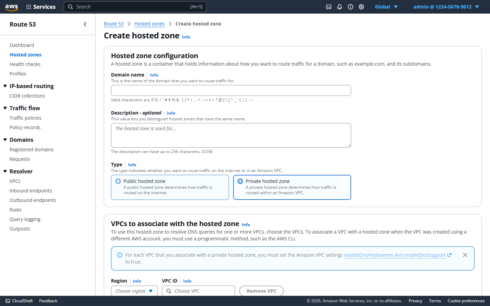

# Amazon Route 53 Clone

A full-stack clone of the **AWS Route 53 management console**. It recreates the console's look, navigation and workflows for managing **hosted zones** and **DNS records**, backed by a real REST API and a persistent SQLite database. The focus is the Route 53 user experience; the app stores and manages DNS configuration but does not answer live DNS queries.

**Live demo:** _add the Vercel URL here after deploying (see [Deployment](#deployment))_
**Demo sign-in:** account ID `123456789012`, IAM username `admin`, password `admin123`

| Sign-in | Hosted zones |
| --- | --- |
|  |  |

| Hosted zone records with details panel | Create hosted zone |
| --- | --- |
|  |  |


---

## Contents

1. [Tech stack](#tech-stack)
2. [Features](#features)
3. [Quick start](#quick-start)
4. [Using the app](#using-the-app)
5. [Architecture](#architecture)
6. [Project structure](#project-structure)
7. [Database schema](#database-schema)
8. [API reference](#api-reference)
9. [Validation and business rules](#validation-and-business-rules)
10. [Testing](#testing)
11. [Configuration](#configuration)
12. [Deployment](#deployment)
13. [Design decisions](#design-decisions)
14. [Troubleshooting](#troubleshooting)

---

## Tech stack

| Layer | Technology | Why |
| --- | --- | --- |
| Frontend | **Next.js 16** (App Router) + **TypeScript** | Typed, file-based routing for the console's page structure |
| UI kit | **Cloudscape Design System** | The open-source design system the AWS console itself is built on, so tables, forms, modals, flash messages and navigation look and behave like Route 53 |
| Data fetching | **TanStack Query** | Caching, background refetch and cache invalidation after every create/edit/delete |
| Backend | **FastAPI** + **Pydantic v2** | Fast, typed REST API with automatic request validation and OpenAPI docs |
| ORM | **SQLAlchemy 2** | Declarative models, constraints and cascades |
| Database | **SQLite** | Zero-setup persistent storage with enforced foreign keys |
| Tests | **pytest** + FastAPI `TestClient` | 50 API tests on an isolated database |

---

## Features

### Console experience
- **AWS-style sign-in page** modeled on the IAM user sign-in screen (account ID, IAM username, password, *Show Password*, *Remember this account*).
- **Console chrome**: dark top bar with the AWS wordmark, *Services*, a search box (`Alt+S`), CloudShell / notifications / help / settings icons, region and account menus; a fixed footer bar; breadcrumbs on every page.
- **Route 53 side navigation**: Dashboard, Hosted zones, Health checks, Profiles, and the *IP-based routing*, *Traffic flow*, *Domains* and *Resolver* groups. Sections outside the assignment scope open a "Coming soon" page.
- **Orange primary buttons**, Info links, two-line green success banners and right-hand details panel, as in the console.

### Hosted zones (full CRUD)
- **List** with the console's columns (name, type, created by, record count, description, hosted zone ID), **property filter** search, sortable and resizable columns, pagination, page-size preferences and a refresh button.
- **Create** public or private zones: domain name, description (with live character count), *Public / Private* tiles, VPC region and ID for private zones, and up to 50 tags. NS and SOA records are created automatically.
- **View** a zone: *Public/Private* badge, collapsible *Hosted zone details*, and tabs for *Records*, *DNSSEC signing* (public zones) and *Hosted zone tags*.
- **Edit** the zone description.
- **Delete** with the console's typed confirmation (`delete`). Like Route 53, a zone can only be deleted once only its default NS and SOA records remain.

### DNS records (full CRUD)
- Record types **A, AAAA, CNAME, MX, TXT, PTR, SRV, CAA and NS**, each validated and normalized by the API.
- **Quick create record**: create several records in one go (*Add another record*), with the console's record-type descriptions, per-type value examples, and **1m / 1h / 1d** TTL shortcuts.
- **Records table** with text search (name or value), *Type*, *Routing policy* and *Alias* filters, sorting, pagination and multi-select.
- **Details panel**: selecting a record shows its details on the right, with *Edit record*.
- **Edit** TTL and values; **delete** one or many records, with the zone's required NS/SOA records protected.

### Bonus features
- **Import BIND zone files**: upload or paste a zone file. Supports `$ORIGIN`, `$TTL` (including `1h`/`1d` units), comments, multi-line `( … )` records, omitted owner names, `@`, relative names and multi-string TXT. The result lists records created, skipped (already present, or the default SOA/NS) and rejected, with line numbers.
- **Export** a hosted zone as a **BIND zone file** or **JSON**. A BIND export re-imports cleanly.
- **Bulk operations**: select several records (or all on the page) and delete them in one action, with a per-record failure report.
- **Dark mode**, toggled from the settings (gear) menu and remembered in the browser.
- **Keyboard shortcuts** (inactive while typing; press `?` in the app to see them):

  | Key | Action |
  | --- | --- |
  | `?` | Show keyboard shortcuts |
  | `/` | Focus the table filter |
  | `Alt` + `S` | Focus the top-bar search |
  | `g` then `h` | Go to hosted zones |
  | `g` then `d` | Go to the dashboard |
  | `c` | Create a hosted zone (zones list) or a record (zone page) |

### Data and session
- All hosted zones, records, tags, users and sessions persist in SQLite.
- Sessions are kept in an `HttpOnly` cookie, so a page refresh keeps you signed in; signing out ends the session on the server.
- The database is created and seeded automatically with a demo user and three sample zones (`example.com`, `internal.corp`, `staging.example.org`) containing a mix of record types.

---

## Quick start

**Prerequisites:** Python 3.11 or newer, Node.js 20 or newer.

### 1. Backend (API on port 8000)

```bash
cd backend
python -m venv .venv
# Windows:      .venv\Scripts\activate
# macOS/Linux:  source .venv/bin/activate
pip install -r requirements.txt
cp .env.example .env              # optional, the defaults work locally
python -m uvicorn app.main:app --reload --port 8000
```

On first start the API creates `route53.db` and seeds the demo data. Interactive API documentation is available at <http://localhost:8000/docs>.

### 2. Frontend (UI on port 3000)

```bash
cd frontend
npm install
npm run dev
```

Open <http://localhost:3000> and sign in with the demo credentials above. The frontend forwards every `/api/*` request to the backend (`BACKEND_URL`, default `http://127.0.0.1:8000`).

---

## Using the app

1. **Sign in** with IAM username `admin` and password `admin123`. The account ID field is optional.
2. **Hosted zones** opens by default. Type in the filter and press Enter to search by name, description or ID, or filter by `Type = Public/Private`.
3. **Create hosted zone**: enter a domain such as `mycompany.com`, choose *Public* or *Private* (a private zone needs a region and VPC ID), optionally add a description and tags, then choose **Create hosted zone**. The new zone opens with its NS and SOA records.
4. **Create record**: on the zone page choose **Create record**, fill in the record name (leave it blank for the root domain), type, value(s) and TTL. Use **Add another record** to create several at once, then **Create records**.
5. **Edit or delete records**: select a row to open the details panel and choose **Edit record**, or select one or more rows and choose **Delete record(s)**.
6. **Import / export**: **Import zone file** on the Records tab accepts a BIND file; **Export zone** on the zone page downloads BIND or JSON.
7. **Delete a hosted zone**: remove its records first (bulk select helps), then choose **Delete zone** and type `delete` to confirm.

---

## Architecture

```
┌──────────────┐  HTTPS   ┌────────────────────────────┐  /api/* rewrite  ┌──────────────────────────────┐
│   Browser    │ ───────▶ │  Next.js frontend (3000)   │ ───────────────▶ │  FastAPI backend (8000)      │
│              │ ◀─────── │  pages, Cloudscape UI,     │ ◀─────────────── │  routers → services → models │
└──────────────┘ cookie   │  TanStack Query cache      │      JSON        │            │                 │
                          └────────────────────────────┘                  │            ▼                 │
                                                                          │   SQLite (route53.db)        │
                                                                          └──────────────────────────────┘
```

**Request flow.** The browser only talks to the Next.js origin. Next.js rewrites `/api/*` to FastAPI on the server side, so the session cookie is first-party and no CORS setup is required.

**Backend layers**
- **routers/**: thin HTTP layer that parses requests, applies the authentication dependency and returns response models.
- **services/**: business logic, covering authentication, zone defaults (automatic NS/SOA), per-type record validation, name resolution, conflict rules, BIND parsing/export and bulk operations. Rule violations raise a `ServiceError` carrying an HTTP status, which a single exception handler turns into a JSON error.
- **schemas/**: Pydantic request and response models.
- **models/**: SQLAlchemy tables, constraints and cascades.
- **core/**: environment-driven settings, database engine/session, password hashing.

**Authentication (mocked IAM).** Credentials are checked against the `users` table (PBKDF2-hashed passwords). A random session token is stored in `sessions` and returned as an `HttpOnly` cookie. Every non-auth endpoint depends on `get_current_user`. On the frontend, an `AuthProvider` restores the session from `/api/auth/me`, and an `AuthGuard` redirects signed-out users to `/login`.

**Frontend state.** Server data lives in TanStack Query caches keyed by zone and query parameters. Mutations invalidate the affected lists (record changes also refresh zone record counts). Page chrome such as breadcrumbs, flash messages and the right-hand panel is managed by `ConsoleShell` through a small context API.

---

## Project structure

```
.
├── backend/
│   ├── app/
│   │   ├── core/            config.py, database.py, security.py
│   │   ├── models/          user.py (users, sessions), hosted_zone.py (zones, tags, records)
│   │   ├── schemas/         auth.py, hosted_zone.py, record.py
│   │   ├── services/        auth, zones, records, record_validation, zone_files (BIND), errors
│   │   ├── routers/         auth.py, hosted_zones.py, records.py, deps.py
│   │   ├── seed.py          idempotent demo data
│   │   └── main.py          app factory, CORS, error handler, startup
│   ├── tests/               pytest suites (auth, zones, records, zone files)
│   ├── Dockerfile
│   └── requirements.txt
├── frontend/
│   └── src/
│       ├── app/
│       │   ├── login/                       AWS-style sign-in page
│       │   └── (console)/                   signed-in area (AuthGuard + ConsoleShell)
│       │       ├── hosted-zones/            list, create
│       │       │   └── [zoneId]/            details, edit, records/{create, import, [recordId]/edit}
│       │       └── [...placeholder]/        "Coming soon" sections
│       ├── components/      ConsoleShell, ConsoleHeader, ConsoleFooter, RecordsTable,
│       │                    RecordForm, RecordDetailsPanel, Delete*Modal, ShortcutsModal, …
│       └── lib/             api client, auth, zones/records hooks, filtering, theme,
│                            hotkeys, download (export), regions, placeholders
├── docs/screenshots/
├── render.yaml              Render blueprint for the API
└── .github/workflows/ci.yml backend tests + frontend type-check, lint and build
```

---

## Database schema

```
users         (id PK, username UNIQUE, password_hash, account_id, created_at)
sessions      (token PK, user_id FK → users ON DELETE CASCADE, expires_at, created_at)
hosted_zones  (id PK "Z…", name, comment, is_private, vpc_region, vpc_id, created_at,
               UNIQUE (name, is_private))
zone_tags     (id PK, zone_id FK → hosted_zones ON DELETE CASCADE, key, value)
dns_records   (id PK, zone_id FK → hosted_zones ON DELETE CASCADE, name, type, ttl,
               value, routing_policy, set_identifier, alias_target, created_at, updated_at,
               UNIQUE (zone_id, name, type, set_identifier))
```

```
users 1 ──── * sessions
hosted_zones 1 ──── * zone_tags
hosted_zones 1 ──── * dns_records
```

- **Hosted zone IDs** follow the Route 53 format (`Z` followed by 19 uppercase letters and digits).
- **Names** are stored lower-cased and fully qualified with a trailing dot (`www.example.com.`).
- **Record values** are stored one per line in `value`, so each row is one record set (name + type), matching Route 53's model.
- **Foreign keys** are enforced (`PRAGMA foreign_keys=ON`); deleting a zone removes its records and tags.
- `routing_policy`, `set_identifier` and `alias_target` are stored for routing policies and alias records. The current UI creates *Simple* records.

---

## API reference

Base path `/api`. Every endpoint except `/health` and `/auth/login` requires the session cookie and returns `401` without it. Errors are returned as `{"detail": "message"}`.

### Auth

| Method | Path | Description |
| --- | --- | --- |
| `GET` | `/health` | Liveness check |
| `POST` | `/auth/login` | `{username, password}` → user; sets the session cookie |
| `POST` | `/auth/logout` | Ends the session and clears the cookie |
| `GET` | `/auth/me` | Current user (`id`, `username`, `account_id`) |

### Hosted zones

| Method | Path | Description |
| --- | --- | --- |
| `GET` | `/hosted-zones` | List zones. Query: `q` (name, ID or description), `type` (`all`/`public`/`private`), `sort_by` (`name`/`type`/`records`/`created`), `desc`, `page`, `page_size` (≤ 100) |
| `POST` | `/hosted-zones` | Create: `{name, comment, is_private, vpc_region, vpc_id, tags[]}`. Adds NS and SOA records |
| `GET` | `/hosted-zones/{id}` | Zone with record count and tags |
| `PATCH` | `/hosted-zones/{id}` | Update the description: `{comment}` |
| `DELETE` | `/hosted-zones/{id}` | Delete; `409` while records other than NS/SOA exist |
| `GET` | `/hosted-zones/{id}/export` | Download as `?format=bind` (default) or `json` |

### Records

| Method | Path | Description |
| --- | --- | --- |
| `GET` | `/hosted-zones/{id}/records` | List. Query: `q` (name or value), `type`, `routing_policy`, `alias` (`yes`/`no`), `sort_by` (`name`/`type`/`ttl`), `desc`, `page`, `page_size` |
| `POST` | `/hosted-zones/{id}/records` | Create: `{name, type, ttl, values[]}`. `name` is relative to the zone (blank = root) |
| `GET` | `/hosted-zones/{id}/records/{record_id}` | Read one record |
| `PUT` | `/hosted-zones/{id}/records/{record_id}` | Update `{ttl, values[]}` (name and type are fixed) |
| `DELETE` | `/hosted-zones/{id}/records/{record_id}` | Delete; the zone's NS/SOA records are protected |
| `POST` | `/hosted-zones/{id}/records/bulk-delete` | `{ids[]}` → `{deleted[], failed[{id, reason}]}` |
| `POST` | `/hosted-zones/{id}/records/import` | `{content}` (BIND text) → `{created, skipped[], errors[]}` |

**Status codes:** `201` created, `204` deleted, `401` not signed in, `404` unknown zone or record, `409` conflict (duplicate zone or record, CNAME conflicts, non-empty zone, protected record), `422` invalid input.

**Example**

```bash
curl -c cookies.txt -X POST localhost:8000/api/auth/login \
     -H "Content-Type: application/json" -d '{"username":"admin","password":"admin123"}'

curl -b cookies.txt -X POST localhost:8000/api/hosted-zones/<ZONE_ID>/records \
     -H "Content-Type: application/json" \
     -d '{"name":"www","type":"A","ttl":300,"values":["192.0.2.10","192.0.2.11"]}'
```

---

## Validation and business rules

These follow Route 53 behavior, and the API enforces them whatever the client sends.

**Hosted zones**
- Domain names must have at least two valid labels (letters, digits, hyphens; no leading or trailing hyphen) and are normalized to lower case with a trailing dot.
- A public and a private zone may share a name; two zones of the same type may not.
- A private zone requires a VPC region and VPC ID.
- Only the description can be changed after creation.
- A zone can be deleted only when its default NS and SOA records are all that remain.

**Records**

| Type | Accepted value format | Example |
| --- | --- | --- |
| A | IPv4 address | `192.0.2.10` |
| AAAA | IPv6 address | `2001:db8::1` |
| CNAME | One domain name | `www.example.com` |
| MX | `priority mail-server` | `10 mail.example.com` |
| TXT | Text (quotes added if missing) | `"v=spf1 -all"` |
| PTR | Domain name | `host.example.com` |
| SRV | `priority weight port target` | `1 10 5269 xmpp.example.com` |
| CAA | `flags tag "value"` | `0 issue "letsencrypt.org"` |
| NS | Name server host names | `ns-1.example.com` |

- Multiple values go on separate lines; duplicates are removed.
- Names are relative to the zone: blank is the root, `www` becomes `www.example.com.`, `*.app` is a wildcard.
- A record set is unique per name and type.
- A CNAME must be the only record at its name and cannot be created at the zone root.
- The zone's root NS and SOA records cannot be deleted.
- TTL must be between 0 and 2,147,483,647 seconds.

---

## Testing

```bash
cd backend
python -m pytest                       # 50 tests on a temporary database

cd frontend
npx tsc --noEmit                       # type-check
npx eslint src                         # lint
npm run build                          # production build
```

The backend suites cover authentication, zone CRUD and search, record validation for every type, name resolution, CNAME and duplicate conflicts, protected records, filtering and pagination, BIND parsing, import, export (including an export → import round trip) and bulk delete. The tests run against a temporary database, so the dev database is never touched.

The main user flows were also run end to end in a real browser, from sign-in, zone and record create/edit/delete, filters, import/export and bulk delete through to dark mode, keyboard shortcuts and sign-out. GitHub Actions runs the backend tests and the frontend type-check, lint and build on every push.

---

## Configuration

**Backend** (`backend/.env`, see `backend/.env.example`)

| Variable | Default | Purpose |
| --- | --- | --- |
| `DATABASE_URL` | `sqlite:///./route53.db` | SQLite file location |
| `CORS_ORIGINS` | `http://localhost:3000` | Allowed origins for direct browser access |
| `SESSION_TTL_HOURS` | `24` | Session lifetime |
| `COOKIE_SECURE` | `false` | Set to `true` when served over HTTPS |
| `COOKIE_SAMESITE` | `lax` | Session cookie SameSite policy |

**Frontend** (`frontend/.env.local`, see `frontend/.env.example`)

| Variable | Default | Purpose |
| --- | --- | --- |
| `BACKEND_URL` | `http://127.0.0.1:8000` | Where Next.js forwards `/api/*` requests |

---

## Deployment

The frontend and backend deploy as two services.

**1. Backend on Render (Docker).** In Render choose *New → Blueprint* and select this repository. [`render.yaml`](render.yaml) builds `backend/Dockerfile`, sets the health check to `/api/health` and enables secure cookies. Note the service URL, for example `https://route53-clone-api.onrender.com`.

**2. Frontend on Vercel.** Import the repository, set *Root Directory* to `frontend`, and add the environment variable `BACKEND_URL` set to the Render URL. The Vercel URL is the public demo link.

**Notes**
- **Data storage:** the database lives at `/app/data/route53.db` in the container. On Render's free plan the disk is reset on each deploy or restart, and the app re-seeds the demo data automatically. To keep data across deploys, attach a persistent disk at `/app/data`.
- **Cold starts:** free Render services sleep when idle; the first request afterwards can take up to a minute.
- **Run the API in Docker locally:** `docker build -t route53-api backend && docker run -p 8000:8000 route53-api`.

---

## Design decisions

- **Cloudscape Design System.** Using the AWS console's own design system gives native-looking tables, forms, modals, flash messages and navigation, plus built-in dark mode and accessibility. Console-specific details (orange primary buttons, top bar, footer, wording) are layered on top.
- **Same-origin API proxy.** Routing `/api/*` through Next.js keeps the `HttpOnly` session cookie first-party and avoids cross-site cookie and CORS configuration.
- **Service layer with typed errors.** Business rules live in services rather than routers; one `ServiceError` handler maps them to HTTP responses, which keeps routers short and rules unit-testable.
- **Server-side validation is authoritative.** The UI repeats only quick checks for instant feedback; the API normalizes and validates every value.
- **One row per record set.** Values are stored newline-separated, mirroring Route 53's record set model and the console's multi-line value box, so name + type uniqueness is a simple database constraint.
- **Idempotent seeding.** A fresh database, including one on a redeploy, is immediately ready to demo.

---

## Troubleshooting

| Problem | Fix |
| --- | --- |
| `Fatal error in launcher: Unable to create process` when running `uvicorn` on Windows | The virtual environment was created in another folder. Run `python -m uvicorn app.main:app --port 8000`, or delete `.venv` and recreate it with `py -m venv .venv`. |
| `python` opens the Microsoft Store on Windows | Use `py` to create the virtual environment; inside an activated venv `python` works normally. |
| Signed out immediately or API calls return `401` | Make sure the backend is running on the port in `BACKEND_URL` and that you open the app through the frontend (port 3000), not the API port. |
| Want to reset the demo data | Stop the backend, delete `backend/route53.db`, and start it again. |
| A hosted zone will not delete | Delete its records first (select all, then **Delete records**); only the NS and SOA records may remain. |
